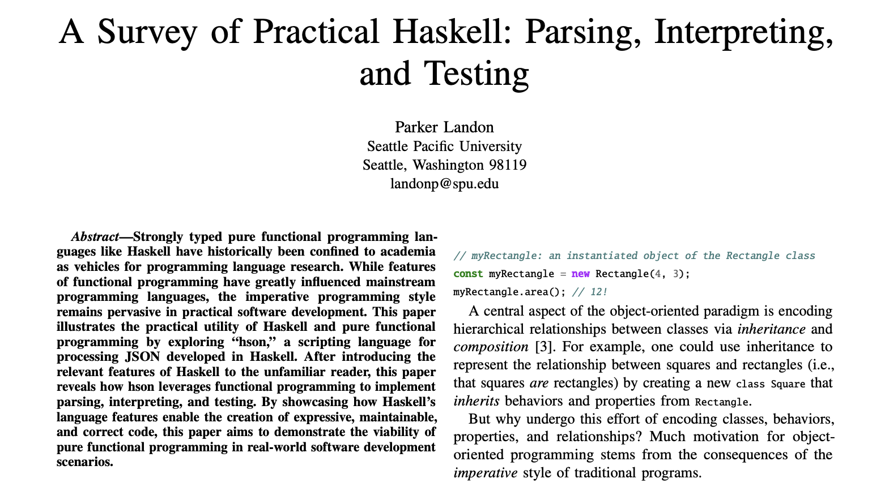

## Who Am I?

Parker Landon, Fullstack Software Engineer

Currently @ Smartsheet


<!-- end_slide -->

## YouTube

Creating dev content @prkrlndn


<!-- end_slide -->

## Personal Project

Working on `habithatchery.com`


<!-- end_slide -->

## Background

I'm a big programming languages nerd.

In my senior year of college, I wrote a research paper about using Haskell for practical software development.



<!-- end_slide -->

<!-- new_lines: 8 -->

## Haskell

- ✅ (Super) Strong Types, like magic 🧙🏼‍♂️
- ✅ Controlled Side-Effects (purity)
- ✅ QuickCheck, Property-Based Testing
- ❌ Bad rap for being too academic

Even the creator of Haskell, Simon Peyton Jones, admits this as part of the Haskell journey:

> "Escape from the ivory tower"

I saw the value in this style of programming, and I wanted it to be applied more broadly.

**Spoiler**: Effect is accomplishing this. I'm not sponsored, just a happy user.

<!-- end_slide -->

<!-- new_lines: 10 -->

## What is Effect?

- (huge!) "Standard Library" for TypeScript
  - Concurrency, Streaming, Pattern Matching, Schema, HTTP, and more!
- Dependency Injection Framework
- "Maximum Type-safety" - dependencies and errors _as types_
- Observability (OpenTelemetry) integration


<!-- end_slide -->

<!-- new_lines: 10 -->

## Does This Even Matter Anymore?

> AI is writing most of my code anyway, why should I care?

> Claude is already good at writing TypeScript!

<!-- end_slide -->

<!-- new_lines: 6 -->

## You Should Care

This is the guy who put me on.


Your agents _will benefit_ from using Effect, too.

<!-- end_slide -->

<!-- new_lines: 10 -->

## Let's Play A Game

Does this function throw an exception?

```ts
function divide(a: number, b: number): number;
```

Even with TypeScript types, there is no way of knowing.

<!-- end_slide -->

<!-- new_lines: 10 -->

## Exceptions

```ts
function divide(a: number, b: number): number {
  if (b === 0) {
    throw new Error("Cannot divide by zero");
  }
  return a / b;
}
```

**Solution**: Wrap everything in try/catch?

<!-- end_slide -->

<!-- new_lines: 10 -->

## Introducing Effect

```ts
function divide(a: number, b: number): Effect.Effect<number, Error, never> {
  if (b === 0) {
    return Effect.fail(new Error("Cannot divide by zero"));
  }
  return Effect.succeed(a / b);
}
```

<!-- end_slide -->

<!-- new_lines: 8 -->

## The Effect Type

```
         ┌─── Produces a value of type number
         │       ┌─── Fails with an Error
         │       │      ┌─── Requires no dependencies
         ▼       ▼      ▼
Effect<number, Error, never>
```

> An `Effect<A, E, R>` is an operation that
>
> - succeeds with a result of type A
> - fails with an error of type E
> - depends on type R (more on this later)

<!-- end_slide -->

<!-- new_lines: 6 -->

```ts
class DivideByZeroError extends Data.TaggedError("DivideByZeroError")<{}> {}

function divide(
  a: number,
  b: number,
): Effect.Effect<number, DivideByZeroError, never> {
  if (b === 0) {
    return Effect.fail(new DivideByZeroError());
  }
  return Effect.succeed(a / b);
}
```

```
         ┌─── Produces a value of type number
         │       ┌─── Fails with a DivideByZeroError
         │       │
         ▼       ▼
Effect<number, DivideByZeroError, never>
```

<!-- end_slide -->

<!-- new_lines: 4 -->

```ts
class DivideByZeroError extends Data.TaggedError("DivideByZeroError")<{}> {}
class NotAnIntegerError extends Data.TaggedError("NotAnIntegerError")<{
  lhs: number;
  rhs: number;
}> {}

function divide(
  a: number,
  b: number,
): Effect.Effect<number, DivideByZeroError | NotAnIntegerError, never> {
  if (!Number.isInteger(a) || !Number.isInteger(b)) {
    return Effect.fail(new NotAnIntegerError({ lhs: a, rhs: b }));
  }
  if (b === 0) {
    return Effect.fail(new DivideByZeroError());
  }
  return Effect.succeed(a / b);
}
```

```
Effect<number, DivideByZeroError | NotAnIntegerError, never>
```

<!-- end_slide -->

<!-- new_lines: 6 -->

## Composing and Running Effects

```ts
// const program: Effect.Effect<void, NotAnIntegerError | DivideByZeroError, never>
const program = Effect.gen(function* () {
  const result: number = yield* divide(4, 2);
  yield* Console.log(result);
});

Effect.runSync(program); // 2
```

The `yield*` syntax on an Effect is analogous to `await` on a Promise.

- `await` "unwraps" the `T` value inside the `Promise<T>`
- `yield*` "unwraps" the `A` value inside the `Effect<A, E, R>`, and propagates all errors `E` up.

```
Effect<void, DivideByZeroError | NotAnIntegerError, never>
```

<!-- end_slide -->

## Handling Errors

```ts
// program: (a: number, b: number) => Effect.Effect<void, never, never>
const program = (a: number, b: number) =>
  Effect.gen(function* () {
    const result = yield* divide(a, b).pipe(
      Effect.match({
        onSuccess: (result) => `success: ${result}`,
        onFailure: (error) =>
          Match.value(error).pipe(
            Match.when(
              { _tag: "DivideByZeroError" },
              () => "failure: cannot divide by zero",
            ),
            Match.when(
              { _tag: "NotAnIntegerError" },
              ({ lhs, rhs }) =>
                `failure: arguments must be integers, received ${lhs} and ${rhs}`,
            ),
            Match.exhaustive,
          ),
      }),
    );
    yield* Console.log(result);
  });

// success: 2
Effect.runSync(program(4, 2));
// failure: cannot divide by zero
await Effect.runPromise(program(3, 0));
// failure: arguments must be integers, received 3.5 and 1
Effect.runSync(program(3.5, 1));
```

<!-- end_slide -->

<!-- new_lines: 10 -->

## What About Dependencies?

```
                        ┌─── Requires no dependencies
                        ▼
Effect<number, Error, never>
```

<!-- end_slide -->

<!-- new_lines: 8 -->

## A Bit About Dependency Injection

```ts
async function getAllBookNames() {
  const bookRepository = new BookRepository();
  const books = await bookRepository.getAllBooks();
  return books.map((book) => book.name);
}
```

If `BookRepository` requires a database connection, how do you test this without a database?

Need to mock the `BookRepository` import, or...

<!-- end_slide -->

<!-- new_lines: 6 -->

## Dependency Injection, continued

```ts
interface BookRepositoryContract {
  getAllBooks(): Promise<Book[]>;
}

function getAllBookNames(bookRepository: BookRepositoryContract) {
  const books = await bookDatabase.getAllBooks();
  return books.map((book) => book.name);
}

// In the application...
const bookRepository: BookRepositoryContract = new BookRepository();
await getAllBookNames(bookRepository);

// In a unit test...
const fakeBookRepository: BookRepositoryContract = new FakeBookRepository();
await getAllBookNames(fakeBookRepository);
```

<!-- end_slide -->

<!-- new_lines: 6 -->

## Dependency Injection Containers

```ts
import { Container } from "inversify";

const BookRepositoryId = Symbol.for("BookRepository");

const container = new Container();
container.bind<BookRepositoryContract>(BookRepositoryId).to(BookRepository);

async function getAllBookNames() {
  const bookRepo = container.get<BookRepositoryContract>(BookRepositoryId);
  const books = await bookRepo.getAllBooks();
  return books.map((book) => book.name);
}
```

- No compile-time guarantees that all dependencies are bound
- You must ensure bindings exist and are registered in the right order at runtime
- Errors surface late — missing bindings blow up at resolution, not at startup
- Container becomes a service locator: hard to trace what depends on what

<!-- end_slide -->

<!-- new_lines: 8 -->

## Effect Services

```ts
interface BookRepositoryContract {
  getAllBooks(): Effect.Effect<Book[], never, never>;
}

export class BookRepository extends Context.Tag("BookRepository")<
  BookRepository,
  BookRepositoryContract
>() {}
```

Services, defined using `Context.Tag`, are contracts without implementation (e.g., `BookRepositoryContract`) that are bound to identifiers (e.g., `"BookRepository"`).

<!-- end_slide -->

<!-- new_lines: 6 -->

## Consuming Services

```ts
// getAllBookNames: Effect.Effect<string[], never, BookRepository>
const getAllBookNames = Effect.gen(function* () {
  const bookRepository = yield* BookRepository;
  const bookNames = yield* bookRepository
    .getAllBooks()
    .pipe(Effect.andThen(Array.map((book) => book.name)));
  return bookNames;
});
```

```
                              ┌─── Requires an implementation of BookRepository
                              ▼
Effect<string[], never, BookRepository>
```

<!-- end_slide -->

<!-- new_lines: 12 -->

## Dependencies As Types

```ts
// TYPE ERROR: Missing 'BookRepository' in the expected Effect context.
Effect.runSync(getAllBookNames);
```

We cannot run the Effect until we've provided implementations for all dependencies.

<!-- end_slide -->

<!-- new_lines: 6 -->

## Providing Implementations with Layers

```ts
const FakeBookRepository = Layer.succeed(BookRepository, {
  getAllBooks: () =>
    Effect.succeed([{ name: "Fake Book 1" }, { name: "Fake Book 2" }]),
});

// program: Effect.Effect<string[], never, never>
const program = getAllBookNames.pipe(
  Effect.provide(FakeBookRepository),
  Effect.tap(Console.log),
);

// [ "Fake Book 1", "Fake Book 2" ];
Effect.runSync(program);
```

We can create implement Services as Layers and provide them to Effect operations when they run.

<!-- end_slide -->

<!-- new_lines: 6 -->

## So What?

**AI Verification Bottleneck**: agents can ship a lot of code, but we have to spend a lot of time reviewing it.

The more bugs we can eliminate with static analysis and good practices, the faster we can ship code confidently.

When we use Effect,

1. Strong types with errors and dependencies make the code self-documenting: agents know exactly what errors need to be handled and what implementations need to be provided.

2. Dependency Injection patterns allow for more easily testable code: agents will have no problem hitting 80% code coverage with _meaningful tests_.

<!-- end_slide -->

<!-- new_lines: 6 -->

## Tips for Using Effect With Agents

1. Clone the official [Effect source code](https://github.com/Effect-TS/effect-smol) locally and reference it in your AGENTS.md.

```md
## Local Effect Source

The Effect v4 repository is cloned to `~/.local/share/effect-solutions/effect` for reference.
Use this to explore APIs, find usage examples, and understand implementation
details when the documentation isn't enough.
```

2. Use [Context7](https://context7.com/) MCP for semantic search over docs.

3. Use [Effect Patterns CLI](https://github.com/PaulJPhilp/EffectPatterns) for semantic search over best practices.

4. [@effect/mcp-server](https://github.com/tim-smart/effect-mcp)

<!-- end_slide -->

<!-- new_lines: 12 -->

## Resources

- [Official Effect Site](https://effect.website/)
- [effect.solutions](https://www.effect.solutions/)
- [My Effect Content!](https://www.youtube.com/@prkrlndn)
